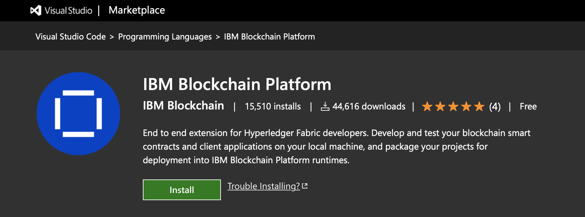
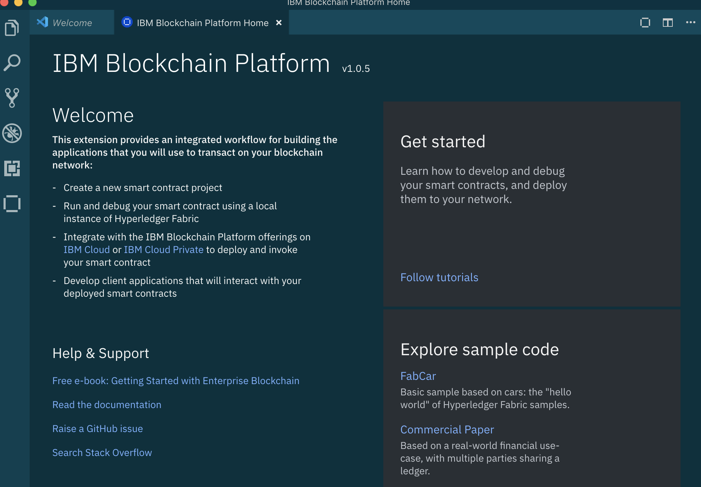
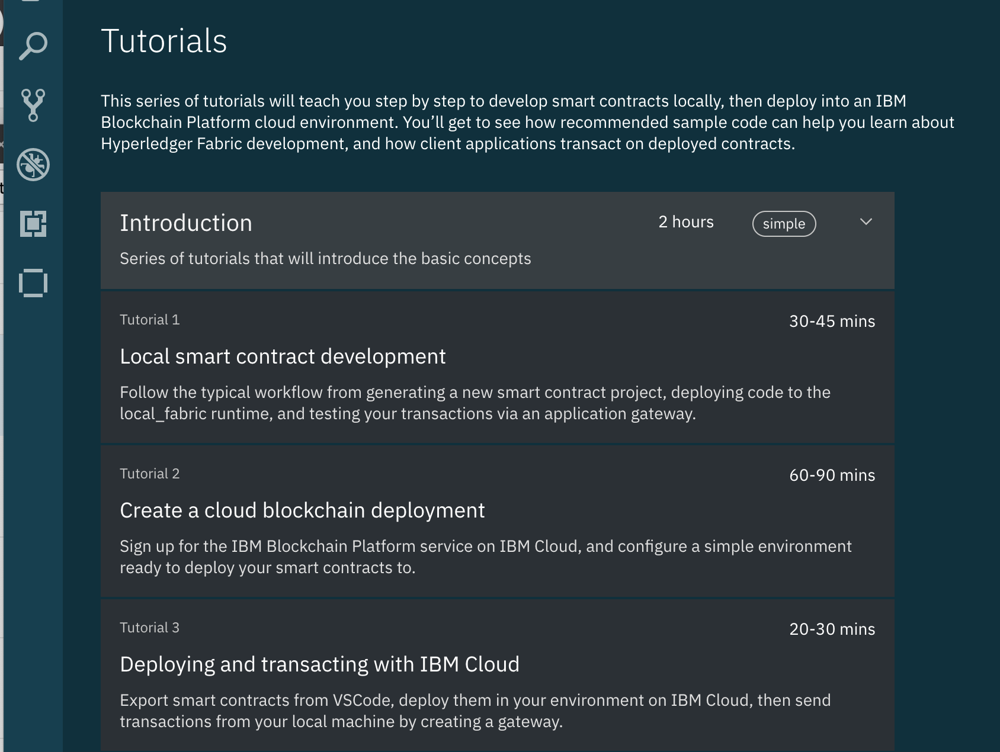
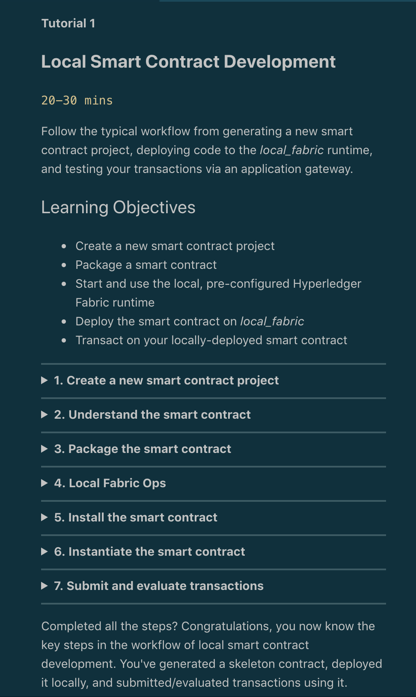
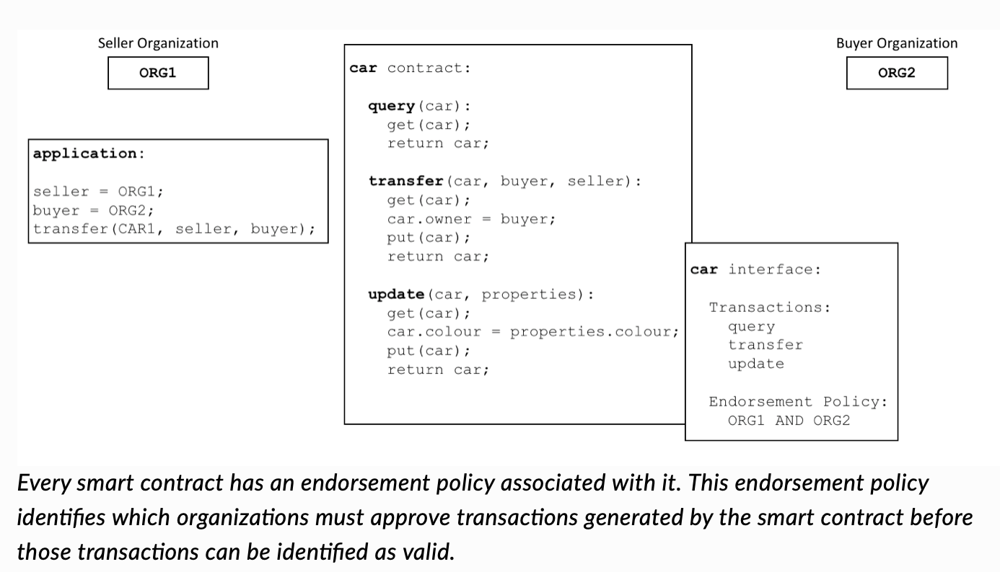
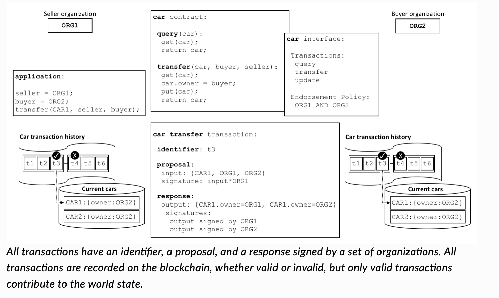
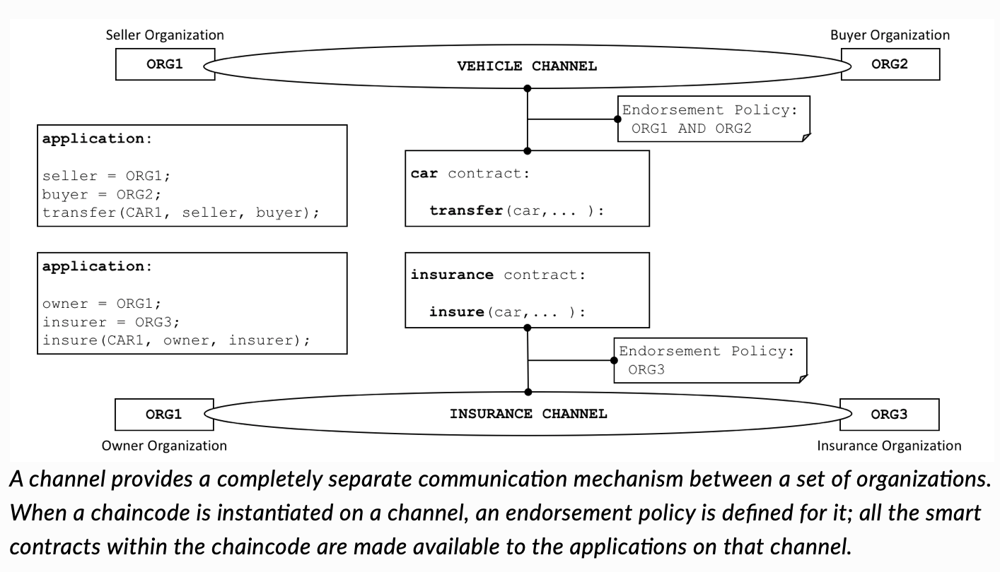

# 2020-1-1-VSCodeExtentionSmartContracts


# Event URL: [https://bit.ly/34P1MJJ./](https://bit.ly/34P1MJJ)

# An introduction to the IBM Blockchain Platform 2.0!

Hyperledger Fabric 2.2: https://www.youtube.com/watch?v=JgENuJcdyE8&feature=youtu.be

# Contacts:

## Linkedin.com/in/lennartfrantzell/
 


[Whitelisting](https://cloud.ibm.com/registration/whitelist)


# [Blockchain Platform Demo](/ibpd.md)

# Sources

<a href="https://hyperledger-fabric.readthedocs.io/en/release-1.4/">Hyperledger Fabric Read the Docs</a>

<a href="https://github.com/hyperledger/fabric">Hyperledger Fabric source code on GitHub</a>
 
# Blockchain 2.0 released! https://youtu.be/JgENuJcdyE8
 

# I) Learning Objectives:

What we will be doing:

## 1. Sign up to a free IBM Cloud account
 
 Why will we sign up to a free IBM Cloud account?
 Because IBM Blockchain Platform runs in the IBM cloud.
 
[https://ibm.biz/BdzSJN](https://ibm.biz/BdzSJN)


 
## 2. Install Visual Studio Code


[Click on link to install Visual Studio Code](https://code.visualstudio.com)
<p>


Why will we install Visual Studio Code?
 Because it comes with a Plugin-in for the IBM Blockchain Platform, which makes it easy to create Smart Contracts.

[Complete instructions: Install IBM Blockchain Platform VS Code extension for free](http://cloud.ibm.com/docs/services/blockchain?topic=blockchain-develop-vscode#develop-vscode-install)


## 3. Install IBM Blockchain Platform Plugin in Visual Studio Code



[Click on link to install IBM Blockchain Platform Plugin in Visual Studio Code](https://marketplace.visualstudio.com/items?itemName=IBMBlockchain.ibm-blockchain-platform) 
 
### Please Note: Install issues documented at: https://github.com/IBM-Blockchain/blockchain-vscode-extension/issues/
 
## 4. Launch IBM Blockchain Platform in the IBM Cloud


 
 
<a href="https://developer.ibm.com/series/ibm-blockchain-platform-console-video-series/">IBM Blockchain Platform Console Video Series</a>
 
 
 
 # II) Developing Smart Contracts in VSCode
 
 
 
 ## 2 Understading the Smart Contract
 
 
The generated smart contract code scaffold provides a good example of some common operations for interacting with data on a blockchain ledger. If you're in a big rush, you could skip this section, but why not stay a while and listen as we learn the basic anatomy of a smart contract!


Notice the lines that start with @Transaction - these are functions that define your contract's transactions i.e. the things it allows you to do to interact with the ledger.


Skipping over the first one (myAssetExists), take a look at the createMyAsset function:
 
 ### Typescript 
 
 ```
    @Transaction()
    public async createMyAsset(ctx: Context, myAssetId: string, value: string): Promise<void> {
        const exists = await this.myAssetExists(ctx, myAssetId);
        if (exists) {
            throw new Error(`The my asset ${myAssetId} already exists`);
        }
        const myAsset = new MyAsset();
        myAsset.value = value;
        const buffer = Buffer.from(JSON.stringify(myAsset));
        await ctx.stub.putState(myAssetId, buffer);
    }
 ```
 ### Java 
 
 ```
 @Transaction()
    public void createMyAsset(String myAssetId, String value) {
        Context ctx = getContext();
        boolean exists = myAssetExists(myAssetId);
        if (exists) {
            throw new RuntimeException("The asset "+myAssetId+" already exists");
        }
        MyAsset asset = new MyAsset();
        asset.setValue(value);
        ctx.putState(myAssetId, asset.toJSONString().getBytes(UTF_8));
    }
 
 ```

The empty brackets in @Transaction() tells us that this function is intended to change the contents of the ledger. Transactions like this are typically submitted (as opposed to evaluated) - more on that later in this tutorial! The function is called createMyAsset and it takes myAssetId and a value, both of which are strings. When this transaction is submitted, a new asset will be created, with key myAssetId and value value. For example if we were to create "001", "A juicy delicious pineapple", then when we later read the value of key 001, we'll learn the value of that particular state is A juicy delicious pineapple.

Now, take a look at the next transaction:

### Typescript 


 ```
 
  @Transaction(false)
    @Returns('MyAsset')
    public async readMyAsset(ctx: Context, myAssetId: string): Promise<MyAsset> {
        const exists = await this.myAssetExists(ctx, myAssetId);
        if (!exists) {
            throw new Error(`The my asset ${myAssetId} does not exist`);
        }
        const buffer = await ctx.stub.getState(myAssetId);
        const myAsset = JSON.parse(buffer.toString()) as MyAsset;
        return myAsset;
    }
 

 ```
 
 
### Java 


 ```

@Transaction()
    public MyAsset readMyAsset(String myAssetId) {
        Context ctx = getContext();
        boolean exists = myAssetExists(myAssetId);
        if (!exists) {
            throw new RuntimeException("The asset "+myAssetId+" does not exist");
        }

        MyAsset newAsset = MyAsset.fromJSONString(new String(ctx.getState(myAssetId),UTF_8));
        return newAsset;


 ```
   
  
This one starts with @Transaction(false) - the "false" means that this function is not typically intended to change the contents of the ledger. Transactions like this are typically evaluated. You'll often hear such transactions referred to as "queries". As you can see, this function only takes myAssetId, and will return the value of the whatever state that key points to.

Take a look at the other transactions in the contract at your leisure, then when you're happy, let's move on to packaging and deploying that contract so that we can start using it...
   
```   

1. In the Fabric Environments panel, look for + Install (it's under Smart Contracts > Installed) and click it.

2, You'll be asked to choose a package to install. Pick demoContract@0.0.1.

You should see demoContract@0.0.1 appear under the Smart Contracts > Installed list.

Command Palette alternative: Install Smart Contract

That's it - job done! Next up, we'll instantiate the smart contract...


``` 

 ## 3 Package the Smart Contract    
   
```   
Now that you have created your smart contract and understand the transactions therein, it’s time to package it. Smart contract projects are packaged into .CDS files - a special type of file that can be installed on Hyperledger Fabric peers.

In the left sidebar, click on the IBM Blockchain Platform icon.

Mouse-over the SMART CONTRACTS panel, click the ... menu, and select Package Open Project from the dropdown.

Command Palette alternative: Package Open Project

If you're using Java, please enter a name and a version for this project. demoContract and 0.0.1 would be perfect.

You should see a new package on the list, demoContract@0.0.1 (or the name you gave to the packaged contract), if everything went well.

The package you just created can be installed onto any Hyperledger Fabric peer (running at the correct version). For example, you could right-click and choose "Export Package", then deploy it into a cloud environment using the IBM Blockchain Platform operational tooling console. We'll learn how to do this later: for now, we'll deploy the package locally on the runtime that comes pre-configured with the VS Code extension, so there's no need to export your package just yet    

```       
    
## 4 Fabric Environments 

The panel titled Fabric Environments (in the IBM Blockchain Platform view) allows you to operate a simple Hyperledger Fabric runtime using Docker on your local machine. Initially, it will be stopped, and you should see:


Local Fabric  ○ (click to start).
Click that message and the extension will start spinning up Docker containers for you. The message "Local Fabric runtime is  starting..." will appear, with a loading spinner, and when the task is complete you will see a set of expandable/collapsible sections labelled Smart Contracts, Channels, Nodes and Organizations.


Command Palette alternative: Connect to a Fabric Environment


That's all you need to do in this step, so if you're in a rush, but whilst you're waiting for Local Fabric to start up, let's learn a little more about what it comprises.


We won't go into too much detail in this tutorial, but here are a few handy facts to know:

## 5 Install the smart contract

In a real network, each of the organizations that will be endorsing transactions will install the smart contract on their peers, then the contract will be instantiated on the channel. Our basic local Fabric runtime only has a single organization (Org1) with a single peer (peer0.org1.example.com) and a single channel (mychannel).

So, we only have to install the contract on that single peer, then we will be able to instantiate it in mychannel. To do this...

```

1. In the Fabric Environments panel, look for + Install (it's under Smart Contracts > Installed) and click it.

2. You'll be asked to choose a package to install. Pick demoContract@0.0.1.

```

You should see demoContract@0.0.1 appear under the Smart Contracts > Installed list.

Command Palette alternative: Install Smart Contract

That's it - job done! Next up, we'll instantiate the smart contract...


## 6 Instantiate the smart contract

Installed smart contracts aren't ready to be invoked by client applications yet: we need a shared instance of the contract that all organizations in the network can use. In our simplified local dev network with just one organization, this is a bit of a moot point! As you'll see in later tutorials though, when multiple organizations are involved, they must individually install the same contract on their respective peers before the group can instantiate on their shared channel. So, it's useful to be thinking about this deployment as a two-stage process even at this early stage: it'll save you some surprises later!


For now though, we've got our contract installed on all (one) of the peers that participate in mychannel so we can go ahead and instantiate.

```
1. In the Fabric Environments panel, look for + Instantiate (it's under Smart Contracts > Instantiated) and click it.

2. You'll be asked to choose a smart contract to instantiate. Pick demoContract@0.0.1.

3. You'll be asked what function to call. If you wanted to use a specific function as part of your instantiate, you could enter something here. We'll see that happen in future tutorials, but for now just hit Enter to skip this step.

4. You'll be asked if you want to provide a private data configuration file. For this tutorial just click No, in future tutorials we will explain more about this.
```

Instantiation will take a while longer than install - watch out for the success message and demoContract@0.0.1 appearing in the Smart Contracts > Instantiated list to confirm it's worked!

Command Palette alternative: Instantiate Smart Contract


## 7 Submit and evaluate transactions

Completed all the steps? Congratulations, you now know the key steps in the workflow of local smart contract development. You've generated a skeleton contract, deployed it locally, and submitted/evaluated transactions using it.


If you wish to spend some more time locally developing your own smart contracts, our Samples (accessed from the extension's homepage) can help you explore development concepts. If you're iterating a lot on your code, you should checkout our Debug tutorial, it's very useful for developers!


There's no need to worry about those concepts yet if you don't want to though: demoContract@0.0.1 is perfect for carrying on with this tutorial series!


 
 <p><p>Click on Tutorial 1 above
<p>
 
 <p>
  Follow the content in the tutorial
  
  
# III) Smart Contract overview 
 

 
 ---------------------------
 


----------------------------



----------------------------

 <a href="https://hyperledger-fabric.readthedocs.io/en/release-1.4/smartcontract/smartcontract.html ">Smart Contracts, see charts above</a>  


 
<table>

<tr>Test of copying text rad 1</tr>
</table>

