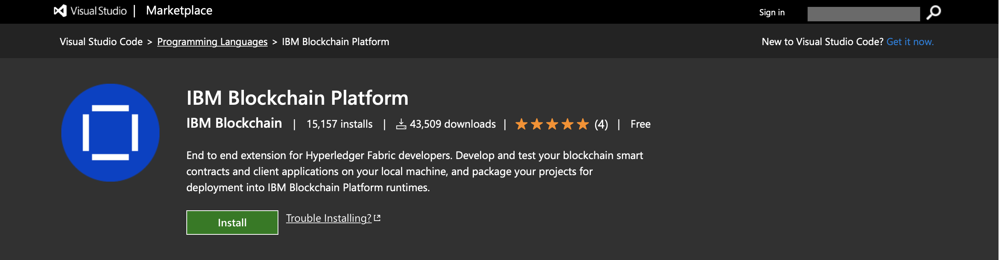
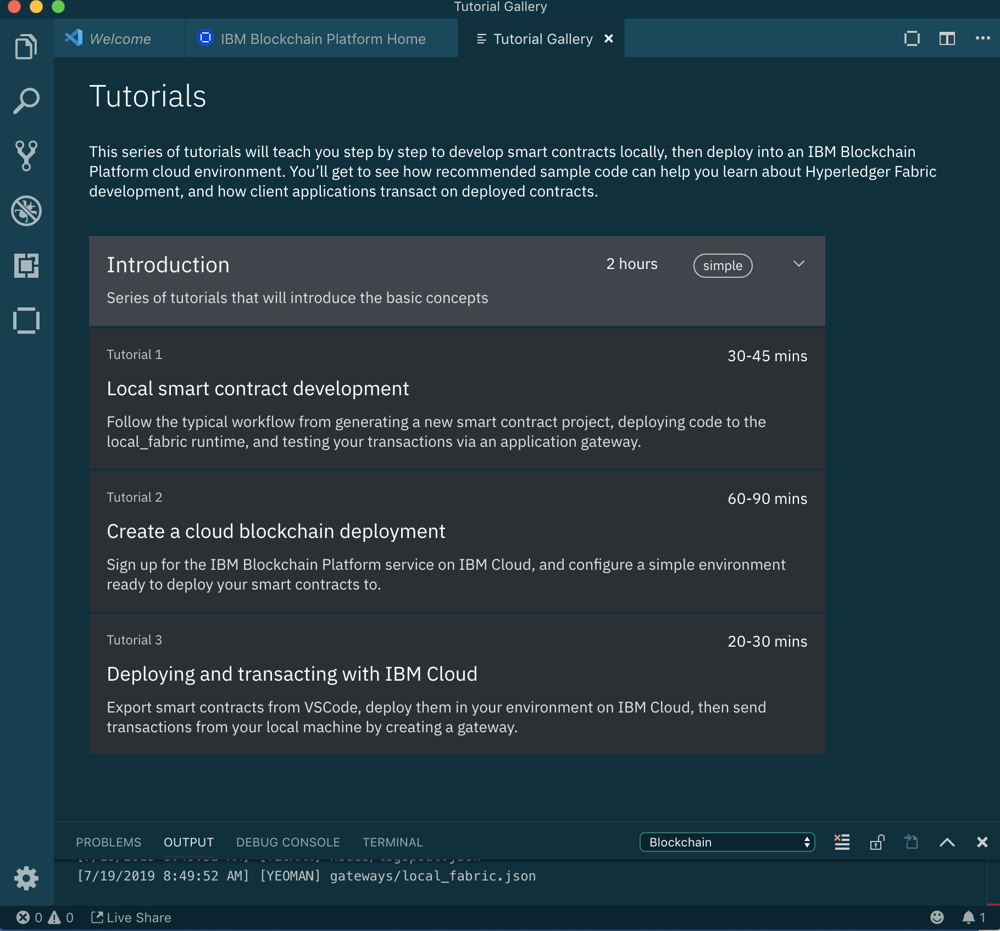

# 2019-8-1-VSCodeExtentionSmartContracts

# Event URL: [https://bit.ly/2LR2WP0](https://bit.ly/2LR2WP0)

# An introduction to the IBM Blockchain Platform 2.0!

# Contacts:

## Linkedin.com/in/lennartfrantzell/
## Linkedin.com/in/drnugent/
 

# Learning Objectives:

## 1. Sign up to a free IBM Cloud accound
 
[https://ibm.biz/BdzPVW](https://ibm.biz/BdzPVW)

 
 
## 2. Install Visual Studio Code 

                                     

## 3. Install the IBM Plugin into VSCode 

### 4. Navigate to tutorials in VSCode

[Complete instructions: Install IBM Blockchain Platform VS Code extension for free](https://cloud.ibm.com/docs/services/blockchain?topic=blockchain-develop-vscode#develop-vscode-install)

Go through Tutorial One in VS Code: Local Smart Contract Development.

Follow the typical workflow from generating a new smart contract project, deploying code to the <i>local_fabric_runtime</i> and testing your transactions via an application gateway</i> 
 

 

## 3. How do we deploy our MVP in the <a href="https://ibm.biz/Bdzmec">IBM Cloud </a> 

### [Installing Visual Studio Code](https://code.visualstudio.com)

### [Installing IBM Blockchain Platform Plugin in Visual Studio Code](https://marketplace.visualstudio.com/items?itemName=IBMBlockchain.ibm-blockchain-platform) 

[Complete instructions: Install IBM Blockchain Platform VS Code extension for free](https://cloud.ibm.com/docs/services/blockchain?topic=blockchain-develop-vscode#develop-vscode-install)

Go through Tutorial One in VS Code: Local Smart Contract Development.

Follow the typical workflow from generating a new smart contract project, deploying code to the <i>local_fabric_runtime</i> and testing your transactions via an application gateway</i> 
 

 
